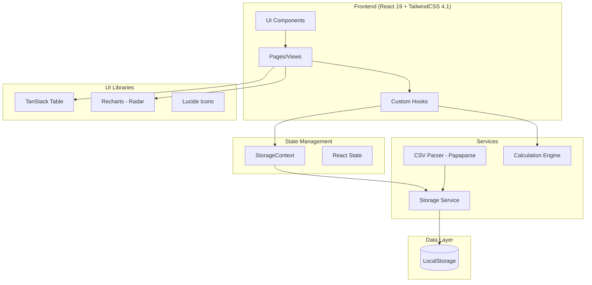

# Design Document: Team Task Allocator (TTA)

## Overview

Team Task Allocator (TTA) là một SPA giúp Leader/Manager phân bổ công việc cho team dựa trên năng lực (Skill) và độ phức tạp (Complexity). Hệ thống tự động tính toán:
- Max Complexity của task
- Skill Gap giữa assignee và task requirements
- Review Status dựa trên level permissions
- Reviewer Suggestions cho tasks cần review

## CSV Data Structure (from BA Team sample files)

### config_rules.csv
| Column | Type | Example |
|--------|------|---------|
| Level ID | number | 1, 2, 3, 4, 5 |
| Level Name | string | Intern 1, Intern 2, Junior, Middle, Senior |
| Max SP Self | number | 0, 3, 6, 12, 50 |
| Review Authority | number | 0, 3, 6, 12, 50 |

### member_profile.csv
| Column | Type | Example |
|--------|------|---------|
| Member Name | string | "Anh Trinh", "Duy Ho" |
| Current Level | string | "Intern 1", "Senior" |
| Last Review Date | string | "December 12, 2025" or empty |
| Requirement Elicitation | number (1-5) | 3 |
| Tech Skill | number (1-5) | 4 |
| Biz Skill | number (1-5) | 4 |
| Doc Skill | number (1-5) | 4 |
| Comm Skill | number (1-5) | 4 |
| Critical Thinking: (Logic) Tư duy phản biện | number (1-5) | 4 |
| Problem-Solving | number (1-5) | 4 |
| UI/UX skill | number (1-5) | 2 |
| Presentation skill | number (1-5) | 3 |

### task_allocation.csv
| Column | Type | Example |
|--------|------|---------|
| Task/Feature | string | "[Syrix Help Desk] MCP integration" |
| Link | string | "XCOR-18024" |
| Requirement Elicitation | number (1-5) | 3 |
| Tech Skill | number (1-5) | 4 |
| Biz Skill | number (1-5) | 3 |
| Doc Skill | number (1-5) | 3 |
| Comm Skill | number (1-5) | 3 |
| Critical Thinking | number (1-5) | 3 |
| Problem-Solving | number (1-5) | 3 |
| UI/UX skill | number (1-5) | 4 |
| Presentation skill | number (1-5) | 3 |
| Max Complexity | number (computed) | 4 |
| Final SP | number | 5 |
| Assignee | string | "Anh Trinh" |
| Skill gap check | string (computed) | "⚠️UI/UX" |
| Suitability Score | number (computed) | 3 |
| Status | string (computed) | "CẦN REVIEW" or "TỰ QUYẾT" |
| Reviewer | string (computed) | "Duy Ho" |
| Review Focus | string (computed) | "Focus: Tech, UI/UX" |
| Reviewer matching | string (computed) | "✅ Hợp lệ" or "—" |

## Architecture



### Technology Stack

- **Framework**: React 19.x / 18.x with TypeScript
- **Styling**: TailwindCSS 4.1
- **Icons**: Lucide-react
- **Charts**: Recharts (Radar Chart)
- **Data Grid**: TanStack Table
- **CSV Parsing**: Papaparse
- **Build Tool**: Vite
- **Testing**: Vitest + fast-check

## Components and Interfaces

### Data Models

```typescript
// Skills are DYNAMIC - loaded from CSV or added via UI
// No hardcoded skill list - system discovers skills from imported data

// Skill definition (stored in TTA_SKILL_META)
interface SkillMeta {
  id: string;           // Unique identifier (UUID)
  name: string;         // Full name from CSV column header (e.g., "Requirement Elicitation")
  shortName: string;    // Short name for display (e.g., "Req") - auto-generated or user-defined
  csvColumnName: string; // Original CSV column name for re-import mapping
  createdAt: string;
  updatedAt: string;
}

// Member with DYNAMIC skills (Record<skillId, value>)
interface Member {
  id: string;
  name: string;           // "Member Name" column
  currentLevel: string;   // "Current Level" column - references ConfigRule.levelName
  lastReviewDate: string; // "Last Review Date" column - format: "Month DD, YYYY" or empty
  skills: Record<string, number>; // skillId -> value (1-5), dynamic based on SkillMeta
  createdAt: string;
  updatedAt: string;
}

// Task with DYNAMIC complexity (Record<skillId, value>)
interface Task {
  id: string;
  name: string;           // "Task/Feature" column
  link: string;           // "Link" column - e.g., "XCOR-18024"
  finalSP: number;        // "Final SP" column
  assignee: string;       // "Assignee" column - member name
  complexity: Record<string, number>; // skillId -> value (1-5), dynamic based on SkillMeta
  createdAt: string;
  updatedAt: string;
}

// Computed task data (not stored, calculated real-time)
interface ComputedTaskData {
  maxComplexity: number;           // MAX of all complexity values
  skillGaps: string[];             // e.g., ["⚠️UI/UX", "⚠️Req"] - uses SkillMeta.shortName
  suitabilityScore: number;        // Can be negative if many gaps
  status: 'TỰ QUYẾT' | 'CẦN REVIEW';
  reviewer: string;                // Suggested reviewer name
  reviewFocus: string;             // e.g., "Focus: Tech, UI/UX" - uses SkillMeta.shortName
  reviewerMatching: '✅ Hợp lệ' | '—';
}

// Configuration rule per level (DYNAMIC - loaded from CSV or added via UI)
interface ConfigRule {
  levelId: number;        // "Level ID" column
  levelName: string;      // "Level Name" column
  maxSPSelf: number;      // "Max SP Self" column
  reviewAuthority: number; // "Review Authority" column
}

// App state - ALL data is dynamic, loaded from CSV or UI
interface AppState {
  members: Member[];
  tasks: Task[];
  configRules: ConfigRule[];  // No default levels - must be imported
  skillMeta: SkillMeta[];     // No default skills - discovered from CSV imports
}

// LocalStorage keys
const STORAGE_KEYS = {
  MEMBERS: 'TTA_MEMBERS',
  TASKS: 'TTA_TASKS',
  CONFIG_RULES: 'TTA_CONFIG_RULES',
  SKILL_META: 'TTA_SKILL_META'
} as const;
```

### Dynamic Skill Discovery

When importing CSV files, the system automatically discovers skills:

1. **From member_profile.csv**: Any column that is not "Member Name", "Current Level", or "Last Review Date" is treated as a skill column
2. **From task_allocation.csv**: Any column that is not "Task/Feature", "Link", "Final SP", "Assignee", or computed columns is treated as a complexity/skill column
3. **New skills**: When a CSV contains a skill not in SkillMeta, the system:
   - Adds it to SkillMeta with auto-generated shortName
   - Adds the skill to all existing members with default value 0
4. **Short name generation**: First word or abbreviation (e.g., "Requirement Elicitation" → "Req", "UI/UX skill" → "UI/UX")

### Service Interfaces

```typescript
// Storage Service
interface StorageService {
  // Members
  getMembers(): Member[];
  saveMember(member: Member): void;
  updateMember(id: string, updates: Partial<Member>): Member;
  deleteMember(id: string): void;
  
  // Tasks
  getTasks(): Task[];
  saveTask(task: Task): void;
  updateTask(id: string, updates: Partial<Task>): Task;
  deleteTask(id: string): void;
  
  // Config Rules
  getConfigRules(): ConfigRule[];
  saveConfigRule(rule: ConfigRule): void;
  updateConfigRule(levelId: number, updates: Partial<ConfigRule>): ConfigRule;
  deleteConfigRule(levelId: number): void;
  
  // Skill Meta
  getSkillMeta(): SkillMeta[];
  addSkill(skill: SkillMeta): void;
  updateSkill(id: string, updates: Partial<SkillMeta>): void;
  deleteSkill(id: string): void;
  
  // Bulk operations
  importMembers(members: Member[]): void;
  importTasks(tasks: Task[]): void;
  importConfigRules(rules: ConfigRule[]): void;
  
  // Export
  exportAll(): AppState;
  exportToCSV(type: 'members' | 'tasks' | 'rules'): string;
}

// CSV Import Service
interface CSVImportResult<T> {
  success: boolean;
  data: T[];
  errors: CSVImportError[];
  newSkillsDetected?: string[];
}

interface CSVImportError {
  row: number;
  column: string;
  message: string;
}

interface CSVService {
  // Parse config_rules.csv: Level ID, Level Name, Max SP Self, Review Authority
  parseConfigRules(csvContent: string): CSVImportResult<ConfigRule>;
  
  // Parse member_profile.csv: Member Name, Current Level, Last Review Date, + 9 skill columns
  parseMemberProfiles(csvContent: string): CSVImportResult<Member>;
  
  // Parse task_allocation.csv: Task/Feature, Link, + 9 complexity columns, Final SP, Assignee
  // Ignores computed columns: Max Complexity, Skill gap check, Suitability Score, Status, Reviewer, Review Focus, Reviewer matching
  parseTaskAllocation(csvContent: string): CSVImportResult<Task>;
  
  // Detect skills in task CSV not present in member profiles
  detectNewSkills(csvContent: string, existingSkills: SkillMeta[]): string[];
}

// Calculation Service
interface CalculationService {
  // MAX(Req, Tech, Biz, Doc, Comm, Critical, ProbSol, UI/UX, Presentation)
  calculateMaxComplexity(task: Task): number;
  
  // Returns skills where Member.skills[skill] < Task.complexity[skill]
  // Format: ["⚠️UI/UX", "⚠️Req", "⚠️Tech"]
  calculateSkillGaps(task: Task, member: Member): string[];
  
  // Compare maxComplexity with member's maxSPSelf from config rules
  // Returns "TỰ QUYẾT" if maxComplexity <= maxSPSelf, else "CẦN REVIEW"
  calculateReviewStatus(task: Task, member: Member, rules: ConfigRule[]): 'TỰ QUYẾT' | 'CẦN REVIEW';
  
  // Find members with reviewAuthority >= maxComplexity
  // Prioritize members with high skills in assignee's gap areas
  suggestReviewers(task: Task, assignee: Member, members: Member[], rules: ConfigRule[]): {
    reviewer: string;
    reviewFocus: string;  // e.g., "Focus: Tech, UI/UX"
    reviewerMatching: '✅ Hợp lệ' | '—';
  };
  
  // Calculate suitability score (can be negative if many gaps)
  calculateSuitabilityScore(task: Task, member: Member): number;
  
  // Ensure all task skills exist in member profiles
  syncSkills(members: Member[], tasks: Task[], skillMeta: SkillMeta[]): SkillMeta[];
}
```

### Component Structure

```
src/
├── components/
│   ├── common/
│   │   ├── Button.tsx
│   │   ├── Input.tsx
│   │   ├── Modal.tsx
│   │   ├── FileDropzone.tsx
│   │   └── StatusBadge.tsx
│   ├── dashboard/
│   │   ├── Dashboard.tsx
│   │   ├── ImportSection.tsx
│   │   └── StatsOverview.tsx
│   ├── members/
│   │   ├── MemberTable.tsx
│   │   ├── MemberRow.tsx (inline edit)
│   │   ├── MemberProfile.tsx
│   │   ├── SkillRadarChart.tsx
│   │   └── SyncSkillsButton.tsx
│   ├── tasks/
│   │   ├── TaskGrid.tsx (TanStack Table)
│   │   ├── TaskRow.tsx (inline edit)
│   │   ├── TaskFilters.tsx
│   │   ├── SkillGapCell.tsx
│   │   ├── ReviewStatusCell.tsx
│   │   └── ReviewerSuggestionCell.tsx
│   └── config/
│       ├── ConfigPanel.tsx
│       ├── LevelRulesTable.tsx
│       └── SkillManager.tsx
├── hooks/
│   ├── useStorage.ts
│   ├── useMembers.ts
│   ├── useTasks.ts
│   ├── useConfigRules.ts
│   ├── useSkillMeta.ts
│   ├── useCalculations.ts
│   └── useCSVImport.ts
├── services/
│   ├── storageService.ts
│   ├── csvService.ts
│   └── calculationService.ts
├── context/
│   └── StorageContext.tsx
├── types/
│   └── index.ts
└── utils/
    ├── validators.ts
    └── helpers.ts
```

## Data Models

### Member Model (dynamic skills from CSV/UI)

| Field | Type | Source | Description |
|-------|------|--------|-------------|
| id | string | (generated) | UUID |
| name | string | CSV: "Member Name" or UI | Member name |
| currentLevel | string | CSV: "Current Level" or UI | References ConfigRule.levelName |
| lastReviewDate | string | CSV: "Last Review Date" or UI | Format: "Month DD, YYYY" or empty |
| skills | Record<string, number> | CSV skill columns or UI | Dynamic - skillId → value (1-5) |
| createdAt | string | (generated) | ISO timestamp |
| updatedAt | string | (generated) | ISO timestamp |

### Task Model (dynamic complexity from CSV/UI)

| Field | Type | Source | Description |
|-------|------|--------|-------------|
| id | string | (generated) | UUID |
| name | string | CSV: "Task/Feature" or UI | Task name |
| link | string | CSV: "Link" or UI | External reference (e.g., "XCOR-18024") |
| finalSP | number | CSV: "Final SP" or UI | Story points |
| assignee | string | CSV: "Assignee" or UI | Member name |
| complexity | Record<string, number> | CSV complexity columns or UI | Dynamic - skillId → value (1-5) |
| createdAt | string | (generated) | ISO timestamp |
| updatedAt | string | (generated) | ISO timestamp |

### ConfigRule Model (from CSV/UI - no defaults)

| Field | Type | Source | Description |
|-------|------|--------|-------------|
| levelId | number | CSV: "Level ID" or UI | Unique level identifier |
| levelName | string | CSV: "Level Name" or UI | Display name |
| maxSPSelf | number | CSV: "Max SP Self" or UI | Max complexity for self-manage |
| reviewAuthority | number | CSV: "Review Authority" or UI | Review authority level |

### SkillMeta Model (discovered from CSV or added via UI)

| Field | Type | Source | Description |
|-------|------|--------|-------------|
| id | string | (generated) | UUID |
| name | string | CSV column header or UI | Full skill name |
| shortName | string | Auto-generated or UI | Short name for display |
| csvColumnName | string | CSV column header | Original column name for re-import |
| createdAt | string | (generated) | ISO timestamp |
| updatedAt | string | (generated) | ISO timestamp |

### Computed Fields (calculated real-time, not stored)

| Field | Type | Formula | Example |
|-------|------|---------|---------|
| maxComplexity | number | MAX(all complexity values) | 4 |
| skillGaps | string[] | Skills where member < task | ["⚠️UI/UX"] |
| suitabilityScore | number | Sum of (member - task) for all skills | 3 |
| status | string | maxComplexity <= maxSPSelf ? "TỰ QUYẾT" : "CẦN REVIEW" | "CẦN REVIEW" |
| reviewer | string | Member with reviewAuthority >= maxComplexity | "Duy Ho" |
| reviewFocus | string | Gap skills for reviewer to focus | "Focus: Tech, UI/UX" |
| reviewerMatching | string | "✅ Hợp lệ" if valid reviewer, else "—" | "✅ Hợp lệ" |

## Correctness Properties

*A property is a characteristic or behavior that should hold true across all valid executions of a system—essentially, a formal statement about what the system should do.*

### Property 1: Data Persistence Round-Trip

*For any* valid Member, Task, ConfigRule, or SkillMeta object, storing it to LocalStorage and then retrieving it SHALL produce an equivalent object.

**Validates: Requirements 1.1, 1.2, 1.3, 1.4, 1.5, 1.6**

### Property 2: CSV Config Rules Parsing

*For any* valid config_rules.csv content with columns (Level ID, Level Name, Max SP Self, Review Authority), parsing SHALL produce ConfigRule objects with:
- levelId as number
- levelName as string (Intern 1, Intern 2, Junior, Middle, Senior)
- maxSPSelf as non-negative number
- reviewAuthority as non-negative number

**Validates: Requirements 2.1, 2.2, 2.5**

### Property 3: CSV Member Parsing with 9 Skills

*For any* valid member_profile.csv content, parsing SHALL produce Member objects where:
- name maps from "Member Name" column
- currentLevel maps from "Current Level" column
- lastReviewDate maps from "Last Review Date" column (format: "Month DD, YYYY" or empty)
- Each of 9 skill columns maps to corresponding skill value (1-5)

**Validates: Requirements 3.1, 3.2, 3.3, 3.4**

### Property 4: CSV Task Parsing with 9 Complexity Columns

*For any* valid task_allocation.csv content, parsing SHALL produce Task objects where:
- name maps from "Task/Feature" column
- link maps from "Link" column
- finalSP maps from "Final SP" column
- assignee maps from "Assignee" column
- Each of 9 complexity columns maps to corresponding complexity value (1-5)
- Computed columns (Max Complexity, Skill gap check, Status, Reviewer, etc.) are ignored during import

**Validates: Requirements 4.1, 4.2, 4.3, 4.4, 4.5**

### Property 5: Max Complexity Calculation

*For any* Task with complexity values (dynamic skill set), maxComplexity SHALL equal:
```
MAX(all complexity values in task.complexity)
```

**Validates: Requirements 10.1, 10.2**

### Property 6: Skill Gap Detection Accuracy

*For any* Task and assigned Member with dynamic skills, skillGaps SHALL contain exactly those skills where:
- Member.skills[skillId] < Task.complexity[skillId]
- Format: "⚠️[SkillMeta.shortName]" (e.g., "⚠️UI/UX", "⚠️Req", "⚠️Tech")
- Multiple gaps comma-separated: "⚠️Req, ⚠️Tech, ⚠️UI/UX"

**Validates: Requirements 11.1, 11.2, 11.3, 11.4**

### Property 7: Review Status Determination

*For any* Task with maxComplexity and assigned Member with currentLevel:
1. Lookup member's maxSPSelf from ConfigRule where levelName === currentLevel
2. If maxComplexity <= maxSPSelf: status = "TỰ QUYẾT"
3. If maxComplexity > maxSPSelf: status = "CẦN REVIEW"

**Validates: Requirements 12.1, 12.2, 12.3, 12.5**

### Property 8: Reviewer Suggestion Validity

*For any* Task with status "CẦN REVIEW":
1. All suggested reviewers SHALL have reviewAuthority >= maxComplexity
2. Reviewers SHALL be prioritized by skills in assignee's gap areas
3. reviewFocus SHALL list gap skills (e.g., "Focus: Tech, UI/UX")
4. reviewerMatching = "✅ Hợp lệ" if valid reviewer found, else "—"

**Validates: Requirements 13.1, 13.2, 13.3, 13.4, 13.5, 13.6**

### Property 9: Skill Sync Completeness

*For any* set of Tasks and Members, after syncSkills:
- Every skill present in any Task's complexity SHALL exist in every Member's skills
- New skills added to members SHALL have default value 0

**Validates: Requirements 8.2, 8.3, 8.4**

### Property 10: Suitability Score Calculation

*For any* Task and Member with dynamic skills, suitabilityScore SHALL be calculated as:
```
Sum of (Member.skills[skillId] - Task.complexity[skillId]) for all skills in SkillMeta
```
Note: Score can be negative if member has many skill gaps.

**Validates: Requirements 14.1, 14.2, 14.3**

### Property 11: Member CRUD Consistency

*For any* sequence of member create, update, and delete operations, the final member list SHALL accurately reflect all operations.

**Validates: Requirements 6.2, 6.3**

### Property 12: Task CRUD Consistency

*For any* sequence of task create, update, and delete operations, the final task list SHALL accurately reflect all operations.

**Validates: Requirements 9.2, 9.3**

### Property 13: Real-time Recalculation

*For any* change to Task complexity or assignee, all computed fields SHALL be recalculated immediately:
- maxComplexity
- skillGaps (format: "⚠️Skill1, ⚠️Skill2")
- suitabilityScore
- status ("TỰ QUYẾT" or "CẦN REVIEW")
- reviewer, reviewFocus, reviewerMatching

**Validates: Requirements 10.2, 11.5, 12.4, 13.7, 14.3**

### Property 14: Export Data Completeness

*For any* export operation:
- JSON export SHALL contain all Members, Tasks, ConfigRules, and SkillMeta
- CSV export SHALL include computed columns (Max Complexity, Skill gap check, Status, Reviewer, Review Focus, Reviewer matching)

**Validates: Requirements 16.2, 16.3, 16.4**

### Property 15: Performance - Calculation Time

*For any* dataset of up to 500 tasks, recalculating all computed columns SHALL complete within 200ms.

**Validates: Requirements 17.1**

## Error Handling

### CSV Import Errors

| Error Type | Condition | User Message |
|------------|-----------|--------------|
| PARSE_ERROR | Invalid CSV format | "Không thể đọc file CSV. Vui lòng kiểm tra định dạng." |
| MISSING_COLUMN | Required column missing | "Thiếu cột bắt buộc: {column}" |
| INVALID_SKILL_VALUE | Skill value not 1-5 | "Dòng {n}: Giá trị skill phải từ 1-5" |
| INVALID_LEVEL | Level ID not found | "Dòng {n}: Level '{level}' không tồn tại" |

### Storage Errors

| Error Type | Condition | User Message |
|------------|-----------|--------------|
| QUOTA_EXCEEDED | LocalStorage full | "Bộ nhớ đầy. Vui lòng xóa bớt dữ liệu." |
| PARSE_ERROR | Corrupted data | "Không thể đọc dữ liệu đã lưu." |

## Testing Strategy

### Unit Tests

- Individual service functions (storage, CSV parsing, calculations)
- Utility functions (validators, helpers)
- React hooks in isolation

### Property-Based Tests

Using **fast-check** library with dynamic skill generation:

```typescript
import fc from 'fast-check';
import { describe, it, expect } from 'vitest';

// Generate dynamic skills (variable number of skills)
const skillArbitrary = fc.dictionary(
  fc.string({ minLength: 1, maxLength: 20 }), // skillId
  fc.integer({ min: 1, max: 5 })              // value 1-5
);

// Property 5: Max Complexity Calculation
describe('Calculation Service', () => {
  it('maxComplexity equals max of all complexity values (dynamic skills)', () => {
    fc.assert(
      fc.property(
        skillArbitrary,
        (complexity) => {
          if (Object.keys(complexity).length === 0) return true;
          const task = { complexity } as Task;
          const result = calculationService.calculateMaxComplexity(task);
          const expected = Math.max(...Object.values(complexity));
          return result === expected;
        }
      ),
      { numRuns: 100 }
    );
  });

  // Property 6: Skill Gap Detection (dynamic skills)
  it('skillGaps contains exactly skills where member < task', () => {
    fc.assert(
      fc.property(
        fc.array(fc.string({ minLength: 1, maxLength: 20 }), { minLength: 1, maxLength: 15 }),
        (skillIds) => {
          // Generate task complexity and member skills for same skill set
          const taskComplexity: Record<string, number> = {};
          const memberSkills: Record<string, number> = {};
          const skillMeta: SkillMeta[] = [];
          
          skillIds.forEach((id, i) => {
            taskComplexity[id] = Math.floor(Math.random() * 5) + 1;
            memberSkills[id] = Math.floor(Math.random() * 5) + 1;
            skillMeta.push({ id, name: id, shortName: id.substring(0, 4), csvColumnName: id });
          });
          
          const task = { complexity: taskComplexity } as Task;
          const member = { skills: memberSkills } as Member;
          const gaps = calculationService.calculateSkillGaps(task, member, skillMeta);
          
          // Verify each gap is valid
          for (const skillId of skillIds) {
            const hasGap = memberSkills[skillId] < taskComplexity[skillId];
            const shortName = skillMeta.find(s => s.id === skillId)?.shortName || '';
            const gapInResult = gaps.some(g => g.includes(shortName));
            if (hasGap !== gapInResult) return false;
          }
          return true;
        }
      ),
      { numRuns: 100 }
    );
  });

  // Property 7: Review Status Determination
  it('status is TỰ QUYẾT when maxComplexity <= maxSPSelf', () => {
    fc.assert(
      fc.property(
        fc.integer({ min: 1, max: 5 }),  // maxComplexity
        fc.integer({ min: 0, max: 50 }), // maxSPSelf
        (maxComplexity, maxSPSelf) => {
          const expectedStatus = maxComplexity <= maxSPSelf ? 'TỰ QUYẾT' : 'CẦN REVIEW';
          // Test implementation should match this logic
          return true; // Placeholder - actual test compares with service result
        }
      ),
      { numRuns: 100 }
    );
  });
});
```

### Test Configuration

- Minimum 100 iterations per property test
- Tag format: **Feature: team-task-allocator, Property {number}: {property_text}**

### Integration Tests

- Full import → calculate → display workflow
- State synchronization between components
- LocalStorage persistence across page reloads
- CSV import with sample files (config_rules.csv, member_profile.csv, task_allocation.csv)
- Dynamic skill discovery from CSV imports
- Adding new skills via UI and syncing to existing members
